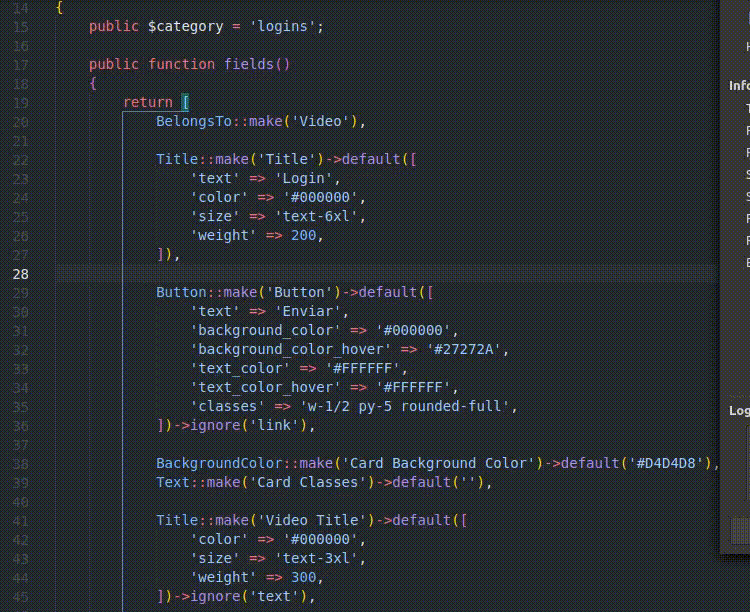

# Tiuswebs Complete


Tiuswebs Complete is a VS Code snippets extension to help you work through all the development of Tiuswebs components.

## Features

Natural snippets, just type as you would, and the snippets will pop up.



The same workflow, faster development.

## Requirements

This extension is dependency-free, the blade syntax is made possible thank to [blade.tmLanguage.json](https://github.com/onecentlin/laravel-blade-snippets-vscode/blob/master/syntaxes/blade.tmLanguage.json).

## Extension Settings

Open `Preferences` -> `Settings`

```
"emmet.triggerExpansionOnTab": true, // enable tab to expanse emmet tags
"blade.format.enable": true,         // if you would like to enable blade format
```

# Credits

Grammar and syntaxis support for Blade by [this awesome extension](https://github.com/onecentlin/laravel-blade-snippets-vscode).
